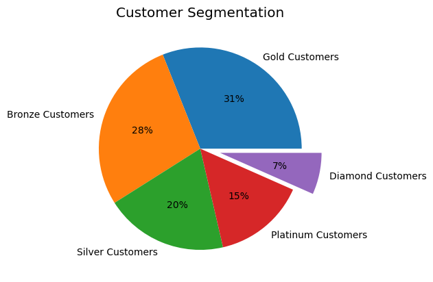

# Customers Segmentation for Marketing
 In this project, we create a customer segmentation for marketing using a RFM model in python. To perform the segmentation, we calculate and score each customer based on how recent they made their last purchase, how often they make a purchase and how much they have spent in purchase since they first order. Using these scores we are able to identify the most valuable customers and the customers at risk of churning.

 ## Project Summary

## Context

The data set contains all the transactions for a UK-based online retail company from 01/12/2010 to 09/12/2011. The company mainly sells unique all-occasion gifts. Many customers of the company are wholesalers.

> The retail company wants to rank and group their customers. They want to identify the most valuable customers and the customers at risk of churning. We will perform the segmentation by using the RFM Model.

RFM (recency, frequency, monetary) analysis is a marketing approach that is used to quantitatively evaluate and group clients based on the recency, frequency and monetary of their most recent transactions in order to pinpoint the best customers and execute focused marketing campaigns. In order to provide an objective analysis, the system gives each consumer a numerical score based on these variables. These scores ranges from 1 to 5. Below are the details of the variables.

**Recency:** What was the customer's most recent purchase? Customers who have recently made a purchase are more likely to make another buy or use the product since they are still thinking about it. This factor is usually measured in days.

**Frequency:** How frequently did this customer buy throughout a certain period of time? Customers who have previously made a purchase are more likely to do so again. In order to turn first-time clients into loyal customers, follow-up advertising may make them a great target.

**Monetary:** How much did the customer spend over a given timeframe? Customers that spend a lot of money are more likely to make additional purchases in the future and are valuable to a company.

RFM analysis is a powerful tool in marketing that helps marketers make the best of their advertising budget. It enables businesses to use a targeted marketing campaigns which a specific group of customers are more likely to respond to.

## Actions

The data contains severals columns which includes the *invoice number, stock code, description, quantity, invoice date, unit price, customer id and country*. We dropped all records with missing *customer ID* and filter out all cancelled transactions. From the data description, we observed that some transactions have a unit price of 0. This could be items purchased through promotions such as *buy 1 get 1 free* or it could be a data entry error. Since we have only 40 transactions with such issues, we will exclude them from this analysis.

We grouped the transactions by customers to help us compute the **Recency**, the **Frequency**, and the **Monetary** values. We then computed scores for the RFM variables of each customer. These scores ranks each customer from 1 to 5 where 5 is the highest rank and 1 is the lowest.

We finally computed the RFM values by summing the scores of Recency, Frequency and Monetary. We then computed the RFM score by ranking the RFM values. We will assign a customer to a segment based on their RFM score. The segments are made up of *Bronze Customers*, *Silver Customers*, *Gold Customers*, *Platinum Customers*, and *Diamond Customers*. A RFM score of 0 corresponds to a *Bronze Customer* and RFM score of 5 corresponds to a *Diamond Customer*.

## Result

Our most valuable customers, **Diamond Customers**, makes up **7%** of our entire customers base. On average, they have purchased 489 times and spent $13,665 on average in this evaluate period. Our customers who are at risk of churning, **Bronze Customers**, makes up **28%** of our entire customers base. On average, they made a purchase only 14 times and spent $253 within the evaluation period.

### Recommendation
Based on the RFM Group, customers with high recency, high frequency and high monetary values (5,5,5) are valuable customers. They should be targeted with special promotions to keep them active.
Customers with high recency and low frequency value (5,1,X) are new customers. A targeted follow-up may convert them into frequent customers.
Customers with low recency but high monetary value (1,X,5) were once valuable customers. A targeted offer may reactivate them.